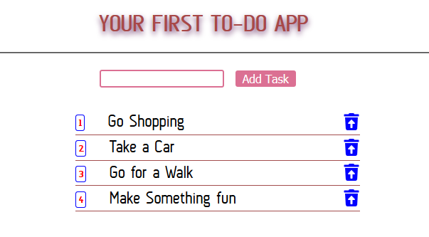

# THIS IS A TO DO APPLICATION MADE IN REACT

#### Initial Project created by react-nano-app

##### Master Branch --> Clean React

##### todoRedux --> converted to use Redux


Link-To-Project: 

# nano-react-app-template

The template project for [nano-react-app](https://github.com/adrianmcli/nano-react-app).

- `npm start` — This will spawn a development server with a default port of `1234`.
- `npm run build` — This will output a production build in the `dist` directory.

## Custom port

You can use the `-p` flag to specify a port for development. To do this, you can either run `npm start` with an additional flag:

```
npm start -- -p 3000
```

Or edit the `start` script directly:

```
parcel index.html -p 3000
```

## Adding styles

You can use CSS files with simple ES2015 `import` statements in your Javascript:

```js
import './index.css';
```

## Babel transforms

The Babel preset [babel-preset-nano-react-app](https://github.com/adrianmcli/babel-preset-nano-react-app) and a small amount of configuration is used to support the same transforms that Create React App supports.

The Babel configuration lives inside `package.json` and will override an external `.babelrc` file, so if you want to use `.babelrc` remember to delete the `babel` property inside `package.json`.
